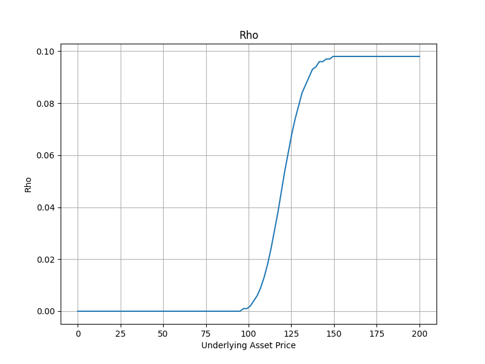

# Terminal-Based Option Pricing Calculator

This project is a simple terminal-based option pricing calculator that allows you to calculate the theoretical price of an option using the Black-Scholes formula. Additionally, it calculates the Greeks of the option and visualizes them in plots.

## Assumptions of the Model

The Black-Scholes model used in this calculator operates under the following assumptions:

- The option is European (can only be exercised at expiration).
- The underlying asset does not pay dividends.
- There are no transaction costs or taxes.
- The risk-free interest rate is constant.
- The volatility of the underlying asset is constant.

## Usage

After cloning the repository and setting up your Python environment, you can run the script from your terminal:

```bash
python main.py

You will be prompted to enter the following inputs:

Price of the underlying asset: The current price of the asset (e.g., stock).
Strike Price: The price at which the option can be exercised.
Time to Maturity: The number of days until the option expires.
Risk-Free Rate: The annualized risk-free interest rate (enter as a decimal, e.g., 0.04 for 4%).
Volatility: The annualized volatility of the underlying asset (enter as a decimal, e.g., 0.3 for 30%).
Option Type: Specify whether the option is a call or put.

```

## Sample Input/Output

Enter the Price of the underlying asset: 100
Enter a Strike Price: 120
Enter a Time to Maturity (in days): 30
Enter a Risk Free Rate (annualized in 0.xx format): .04
Enter a Volatility (annualized in x.xx format): .3
Enter an Option Type (call/put): call
d1: -2.039
d2: -2.125
Price: 0.06

Delta: 0.021
Gamma: 0.006
Theta: -0.007
Vega: 0.014
Rho: 0.002

## Plots

The script will generate and save the following plots in the ./plots/ directory:

Option Price Plot: Shows the option price as a function of the underlying asset price.


Delta Plot: Shows the Delta Greek as a function of the underlying asset price.


Gamma Plot: Shows the Gamma Greek as a function of the underlying asset price.


Vega Plot: Shows the Vega Greek as a function of the underlying asset price.


Theta Plot: Shows the Theta Greek as a function of the underlying asset price.


Rho Plot: Shows the Rho Greek as a function of the underlying asset price.



## Installation

To install the required dependencies, you can use the following command:

bash
Copy code
pip install -r requirements.txt

## License
This project is licensed under the MIT License. See the LICENSE file for details.
